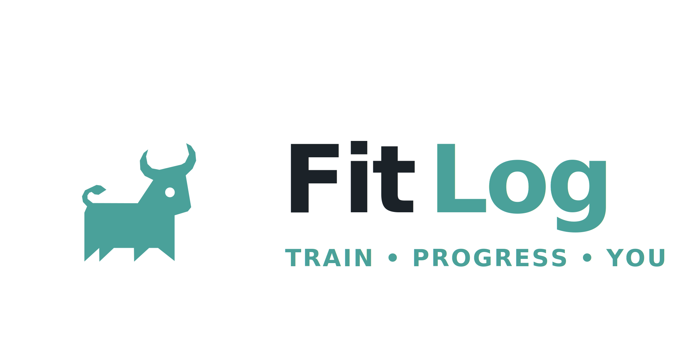
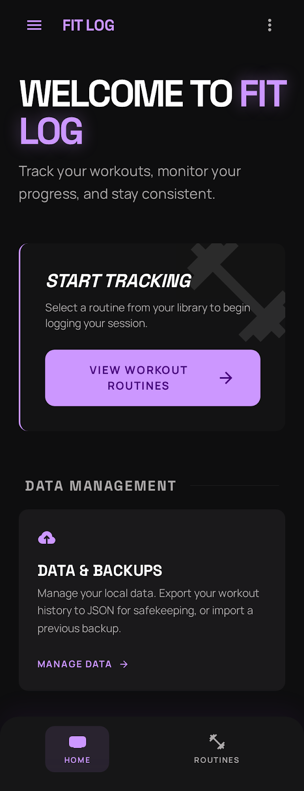
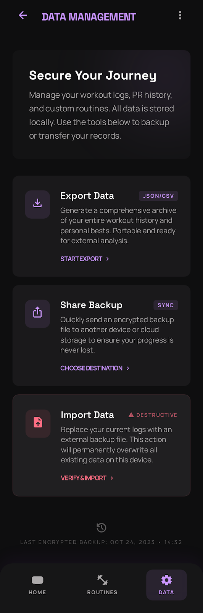
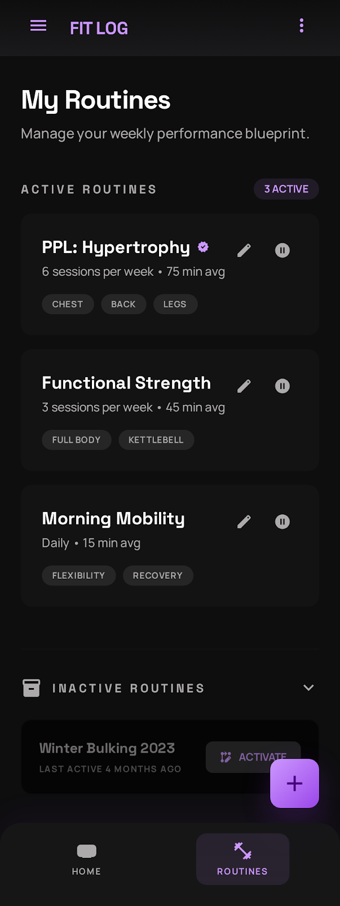
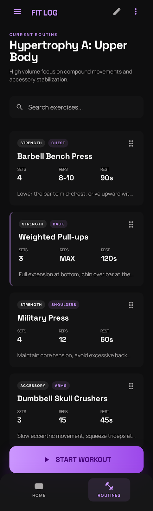
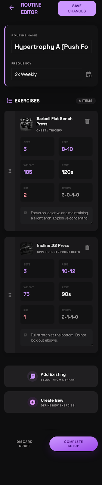
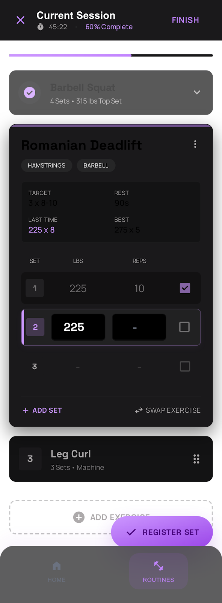
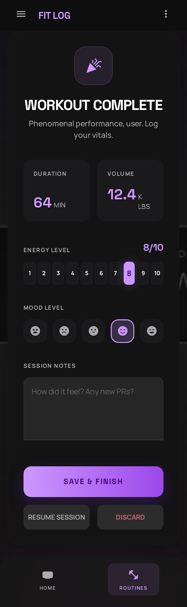
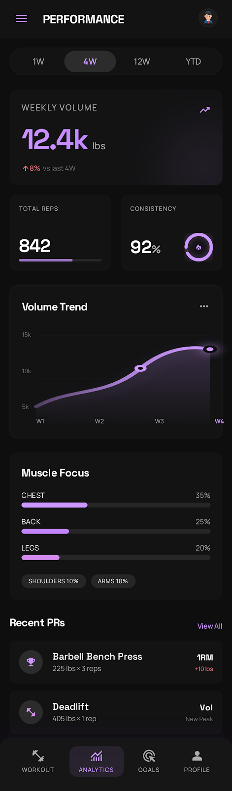
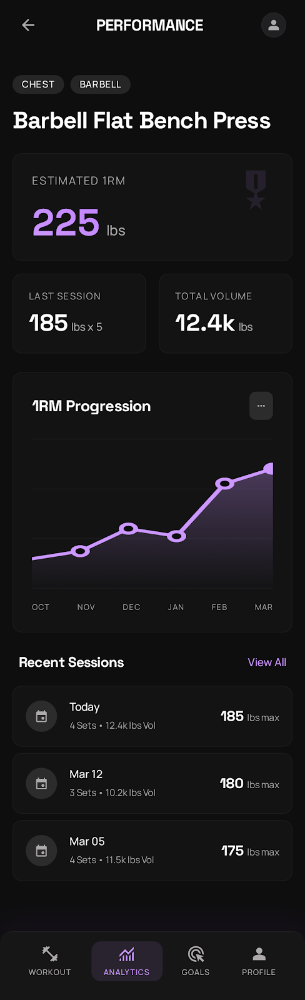

<p align="center">
  
</p>

<p align="center">Routine-based training, fast session logging, and local-first workout backups.</p>

Fit Log is a Flutter workout tracker focused on routine-based training, fast in-session logging, and local-first data ownership. The app is designed for lifters who want structured routines, quick set registration during a workout, and backup-friendly data they can keep on-device.

The current product experience is built around three primary tabs:

- `Home` for the landing dashboard and entry into the main flows
- `Routines` for routine management, exercise browsing, editing, and active sessions
- `Performance` for analytics based on current active routines and exercise-level progress

## Product Overview

Fit Log helps users do four things well:

1. Build and manage structured workout routines
2. Start an active session and log sets quickly with `kg`, reps, RIR, rest timing, and notes
3. Finish a session with a dedicated summary flow for energy, mood, notes, and saved logs
4. Export or import the app state through ZIP or table-level `.xlsx` files

The app uses a dark Kinetic-Noir visual system across the redesigned flows. The implemented UX emphasizes fast read/write performance, compact session logging, and local-first backups instead of cloud sync.

## Implemented UX

### Primary Navigation

- `Home Dashboard`: entry screen for the app, with shortcuts into routine tracking and data management
- `Routines Library`: overview of active and inactive routines, optimized for quick drill-down into a program
- `Performance Dashboard`: analytics for current active routines only, filtered by a selected time window

### Routine Flow

- `Exercise List`: routine detail before a workout starts, with search and direct access to exercise progress
- `Routine Editor`: full routine editing flow for metadata, exercises, and programmed set details
- `Active Workout Session`: compact logging screen with global set registration, `kg` only, rest timer, notes, and per-exercise set controls
- `Finish Session Summary`: full-screen end-of-workout review before saving the session
- `Exercise Progress Detail`: exercise-centric progress screen accessed from the exercise list

### Secondary Flow

- `Data Management`: export/import backups and move between the main app flows without leaving the local-first model

## Implemented Screens

### Home Dashboard

The home screen is the main entry point. It introduces the app, points users to routine tracking, and exposes `Data Management` as a secondary operational screen.



### Data Management

The data screen handles export, share, and import flows. It is intentionally isolated from the main tabs so users can perform backup operations without mixing them into the training flow.



### Routines Library

This screen is the main planning hub. Users can inspect active routines, reactivate inactive ones, create plans, and enter a specific routine.



### Exercise List

This is the pre-workout view for a selected routine. It shows the programmed exercises, supports filtering, and provides a direct `Progress` action for each exercise before the session starts.



### Routine Editor

The editor is a form-driven workflow for changing routine metadata and programmed exercise details without dropping into JSON or raw data editing.



### Active Workout Session

The active session screen is optimized for fast logging. It uses `kg` only, keeps the global `REGISTER SET` action, supports `+ set` and `- set`, and avoids heavy history UI during the workout.



### Finish Session Summary

The finish screen is a dedicated full-screen review of the session draft before persisting the workout logs and session summary.



### Performance Dashboard

The dashboard aggregates training data for the currently active routines in the selected window. It shows volume, day coverage, muscle focus, and recent PR-style signals.



### Exercise Progress Detail

The progress detail screen is exercise-centric. It aggregates logs by `exerciseId` and provides estimated 1RM, total volume, trend, and recent session context for a single exercise.



## Data Model and Storage

Fit Log uses a hybrid local storage model:

- `SQLite` is the runtime source for routines, exercises, plan details, workout logs, and workout sessions
- `.xlsx` tables are retained for compatibility, import/export, and human-readable backups
- startup warmup seeds or rebuilds the runtime cache from `.xlsx` when needed

Current tables and backup artifacts include:

- `fit_log.db`
- `workout_plan.xlsx`
- `exercise.xlsx`
- `plan_exercise.xlsx`
- `workout_log.xlsx`
- `workout_session.xlsx`
- `user.xlsx`
- `body_metrics.xlsx`
- `muscle.xlsx`
- `exercise_target.xlsx`

Operationally, the app now favors SQLite for responsive reads and writes during normal use, while still exporting a portable ZIP backup that includes both the database and spreadsheet-compatible tables.

## Current Navigation Model

The current app shell exposes three primary tabs from the bottom navigation:

- `Home`
- `Routines`
- `Performance`

The following screens are secondary routes opened from those tabs:

- `Data Management`
- `Exercise List`
- `Routine Editor`
- `Exercise Progress Detail`
- `Active Workout Session`
- `Finish Session Summary`

## Performance and Analytics Scope

The analytics layer is intentionally scoped and should be read with these constraints in mind:

- `Performance Dashboard` is based on current active routines only
- the time selector changes the window, but does not include inactive routines unless they are active again
- `Exercise Progress Detail` is keyed by `exerciseId`, so continuity depends on keeping the same exercise record instead of deleting and recreating it as a new id

This makes the dashboard good for understanding the current training block, while the exercise detail view is better for following a specific lift over time.

## Development Setup

### Requirements

- Flutter `3.5` or newer
- Dart SDK compatible with the version declared in `pubspec.yaml`

### Install dependencies

```bash
flutter pub get
```

### Run the app

```bash
flutter run
```

At startup the app:

1. ensures the expected `.xlsx` tables exist
2. warms up the SQLite routine/runtime cache
3. initializes local notifications used by the workout flow

## Development Notes

- The app is organized under `lib/src/` by feature and responsibility
- UI lives in `presentation`
- domain contracts live in `domain`
- repositories and storage adapters live in `data`

Important runtime entrypoints:

- [main.dart](/mnt/c/Users/Cybac/Documents/New_folder/fit_log/lib/main.dart)
- [app.dart](/mnt/c/Users/Cybac/Documents/New_folder/fit_log/lib/src/app.dart)
- [main_scaffold.dart](/mnt/c/Users/Cybac/Documents/New_folder/fit_log/lib/src/navigation/main_scaffold.dart)
- [workout_storage_service.dart](/mnt/c/Users/Cybac/Documents/New_folder/fit_log/lib/src/data/services/workout_storage_service.dart)

## Backup and Import

The app supports:

- exporting a full ZIP backup
- sharing the generated backup file
- importing a full ZIP backup
- importing individual `.xlsx` tables when supported by the data layer

Backups are meant to preserve local ownership of the training data while keeping the runtime optimized for SQLite.

## Validation

Run the main validation steps with:

```bash
flutter test
```

And for targeted static validation:

```bash
flutter analyze
```

## Status

The redesigned experience currently covers the main workflow from app entry to routine management, active workout logging, session summary, analytics, and backup operations. Future design folders outside the implemented screen list are not part of the shipped README documentation yet.
